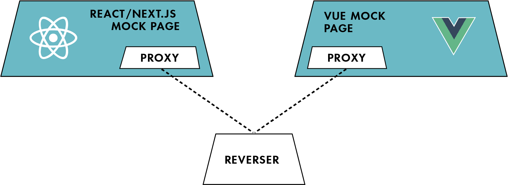
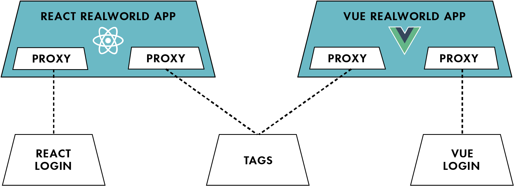

# Plutt Examples Collection

This repo contains examples on how to use [Plutt](https://github.com/digitalroute/plutt). There are two use cases in this repository:

- Reverse Name Application
- RealWorld Example App

Both use cases have a React/Next.js and Vue implementation.

## Reverse Name Application

[Reverse Name Application](https://github.com/juliuscc/plutt-name-reverse-example) is a simple application that reverses a string. It is implemented in both React/Next.js and Vue. Both applications share the same plutt application.

[Link to monorepo](https://github.com/juliuscc/plutt-name-reverse-example)

## RealWorld Example App

RealWorld Example App is a fork of two [RealWorld Example Apps](https://github.com/gothinkster/realworld). They share one Plutt application and have one custom Plutt application each.

**RealWorld Example Apps:**

- [React RealWorld Example App](https://github.com/juliuscc/next-realworld-example-app)
- [Vue RealWorld Example App](https://github.com/juliuscc/vue-realworld-example-app)

**Plutt Apps:**

- [Tags](https://github.com/juliuscc/realworld-plutt-microapp-tags)
- [React Login](https://github.com/juliuscc/realworld-plutt-microapp-login)
- [Vue Login](https://github.com/juliuscc/realworld-plutt-microapp-vue-login)

